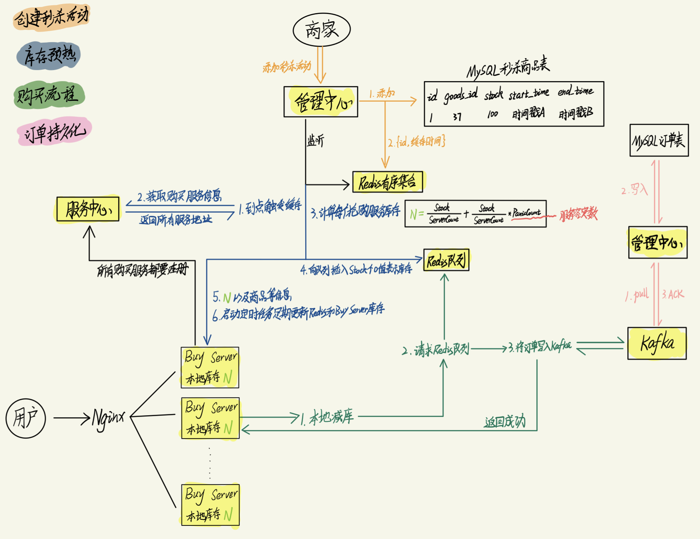

# spikeBuy
秒杀商品

### 架构

| 基础设施 | 名称       | 功能                                  | 端口      |
| -------- | ---------- | ------------------------------------- | --------- |
| nacos    | 服务发现   | 购买服务的发现、注册、管理            | 8848      |
| kafka    | 消息队列   | 记录订单，避免直接请求Mysql，加快响应 | 9092~9094 |
| mysql    | 关系数据库 | 持久化用户、商品、秒杀活动、订单      | 3306      |
| redis    | 缓存库     | 每个秒杀商品的总库存                  | 6379      |

| 模块           | 名称     | 功能                                                 | 端口  |
| -------------- | -------- | ---------------------------------------------------- | ----- |
| services/goods | 管理中心 | 添加秒杀活动、库存预热、定期更新库存、持久化订单消息 | 8000  |
| services/buy   | 购买服务 | 购买秒杀商品                                         | 8001~ |

